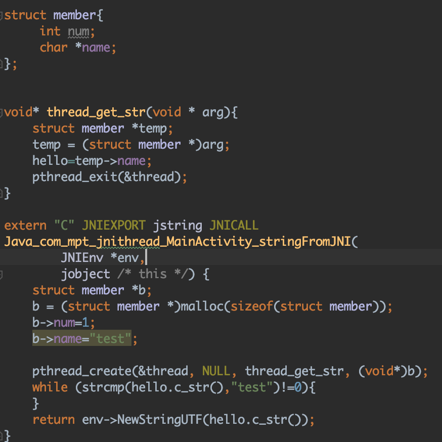
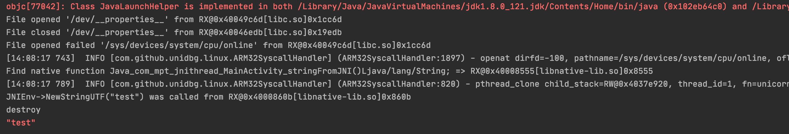

# unidbgMutilThread

## License
- unidbg uses software libraries from [Apache Software Foundation](http://apache.org). 
- unidbg developer Idea enterprise licenses are supported by [Jetbrains](https://www.jetbrains.com?from=unidbg).
- [IntelliJ IDEA](https://www.jetbrains.com/idea?from=unidbg) can be used to edit unidbg sources.
- 

## 简介

基于[unidbg](https://github.com/zhkl0228/unidbg)实现了Android arm32位的多线程，目前还有许多不完善的地方。
测试代码 /unidbg-android/src/test/java/com/ThreadTest.java

### 存在的问题
由于是使用指令条数作为时间片，所以可能会被sleep阻塞，建议在syscall中patch掉sleep.

## Thanks
- [unicorn](https://github.com/zhkl0228/unicorn)
- [dynarmic](https://github.com/MerryMage/dynarmic)
- [HookZz](https://github.com/jmpews/Dobby)
- [xHook](https://github.com/iqiyi/xHook)
- [AndroidNativeEmu](https://github.com/AeonLucid/AndroidNativeEmu)
- [usercorn](https://github.com/lunixbochs/usercorn)
- [keystone](https://github.com/keystone-engine/keystone)
- [capstone](https://github.com/aquynh/capstone)
- [idaemu](https://github.com/36hours/idaemu)
- [jelf](https://github.com/fornwall/jelf)
- [whale](https://github.com/asLody/whale)
- [kaitai_struct](https://github.com/kaitai-io/kaitai_struct)
- [fishhook](https://github.com/facebook/fishhook)
- [runtime_class-dump](https://github.com/Tyilo/runtime_class-dump)
